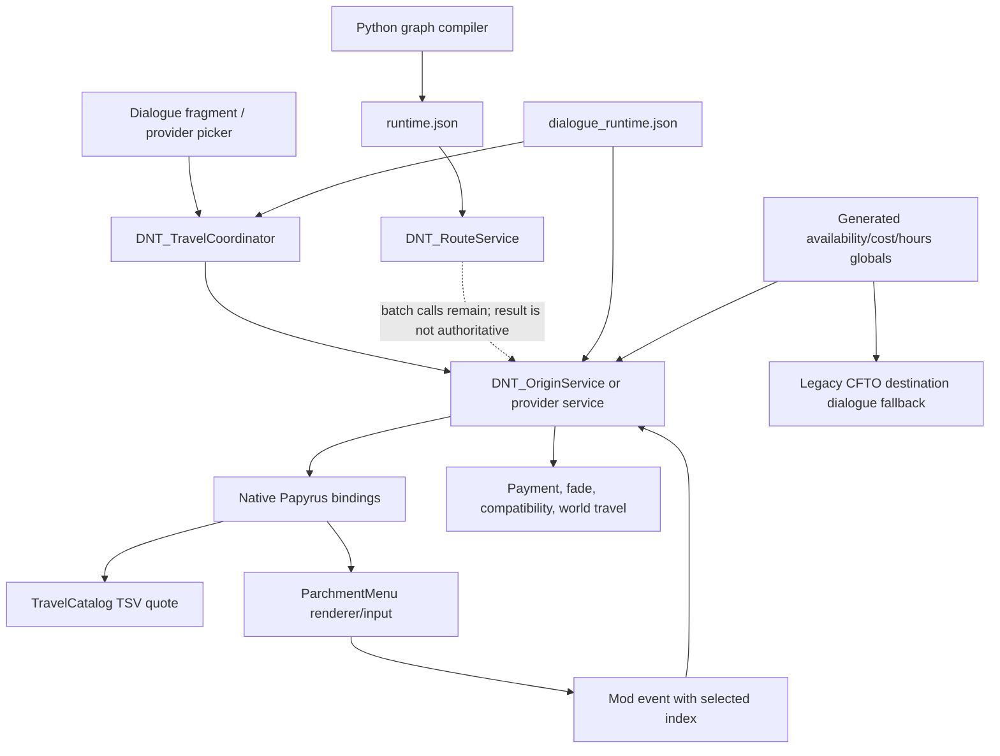
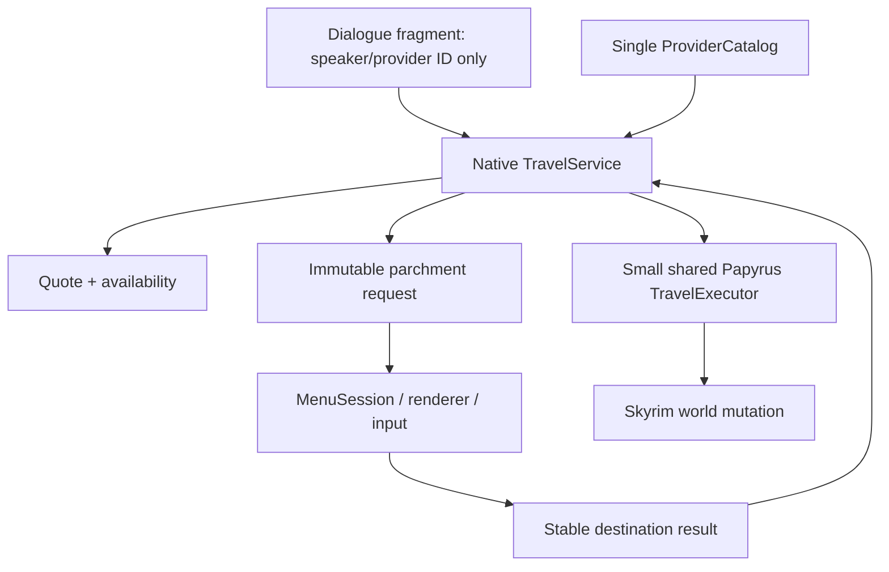

# Codebase audit and pre-release cleanup plan

Audit date: 2026-08-10  
Behavior checkpoint: `efc32bd` (`checkpoint: controller-proven release candidate`)

## Executive verdict

The checkpoint is a good **gameplay fallback**, but it is not yet a source-quality
release candidate. The current build contains a coherent native parchment menu
and a proven set of providers, but it also carries an older graph/dialogue
architecture through compilation, plugin generation, packaging, tests, and
documentation. This makes the project harder to understand than the runtime
behavior requires and creates several opportunities for two sources of truth to
diverge.

Do not publish this checkpoint as the first Nexus source release. Use it as the
golden behavioral reference while the cleanup proceeds in small integration
gates.

The most important conclusions are:

1. Fix Apparition deactivation before any structural work. Live evidence shows
   that the holder effect can remain present while
   `fFastTravelSpeedMult` has returned to `1.0`; the current `holder OR speed`
   detector therefore leaves zero-time travel active.
2. Delete the obsolete graph path from the release, not merely from the runtime
   call site. It is still generated, compiled, audited, tested, and packaged.
3. Make one native catalogue the authoritative source for carriage metadata,
   quotes, marker references, and request construction.
4. Replace the repeated provider-specific payment/fade/travel Papyrus with one
   small shared execution service. Papyrus should remain only where Skyrim world
   mutation or dialogue integration makes it useful.
5. Split the two native monoliths before public review, and replace the current
   wildcard package assembly with an explicit release manifest.
6. Add a repository license and a clean-clone build path. The dependency and
   asset provenance documentation is already unusually strong.

## What was verified

- The checkpoint commit is `efc32bd`; the worktree was clean immediately after
  the checkpoint.
- Native offline tests pass: 2/2 CTest targets.
- Python offline tests pass: 10/10 `unittest` cases.
- The latest gameplay pass proved the parchment maps and controller navigation.
- The same gameplay pass disproved Apparition toggle-off behavior.
- The packaged beta contains one ESP, one SEQ, one native DLL, 26 PEX/PSC pairs,
  `runtime.json`, `dialogue_runtime.json`, `travel_catalog.tsv`, and textures.

The Python result is not as reassuring as its number suggests: those ten tests
exercise the graph compiler/evaluator that is no longer authoritative for the
displayed carriage quote.

## Current architecture

The runtime is a hybrid of native C++ presentation/catalogue code and Papyrus
world mutation. The useful architecture is currently wrapped in a legacy
dialogue/global layer:



### Carriage request and purchase

1. `DNT_CarriageParchmentPicker.OpenMap` resolves the speaker's origin service
   through `DNT_TravelCoordinator`.
2. Native `BuildCarriageRequest` enumerates the flat catalogue and computes
   direct fares/hours.
3. Native code stores `request id -> ordered destination IDs` in an
   `unordered_map` protected by a mutex.
4. The menu returns a selected index. Native code consumes it and returns the
   stable destination ID.
5. `DNT_TravelCoordinator.Purchase` re-resolves the origin service.
6. `DNT_OriginService.CommitDestination` recomputes the native quote, resolves a
   CFTO marker, charges the player, and invokes the shared compatibility travel
   helper.

This is a sound high-level flow. The problems are redundant data and legacy
steps inside it.

### Wizard and ferry providers

Wizard and ferry pickers construct requests through the generic native request
API. Their Papyrus travel services then revalidate gates, charge, fade, and
travel. Four packaged ferry services and the wizard service repeat much of this
logic with different stop tables and gates.

### Native menu

`ParchmentCore` owns provider-independent request validation, layout, hit
testing, and controller selection. `ParchmentMenu` owns runtime state, texture
loading, Menu Framework rendering, mouse/controller input, HUD suppression,
cursor drawing, route drawing, and result dispatch. `Papyrus.cpp` owns both the
generic binding surface and several product-specific builders/probes.

## Data structures in use

### Flat travel catalogue

`TravelCatalog` uses typed value objects:

- `Availability`: open, one-way, or quest-locked;
- `TravelMode`: timed or instant;
- `FormSpec`: plugin name plus plugin-local FormID;
- `Location`: stable ID, label, normalized coordinates, arrival marker, and
  availability;
- `ProviderPolicy`: hours/map-unit, fare/map-unit, minimum fare, and fare step;
- `RouteOverride`: optional fare/hour override for one provider and endpoint
  pair;
- `QuoteOptions` and `Quote`.

The catalogue stores vectors of locations, policies, and overrides. For 27
carriage destinations, linear lookup is simple and fast enough. The current
runtime unnecessarily copies the whole location vector and repeats linear
lookups while building a request; this is worth cleaning up, but it is not the
primary latency source.

### Parchment request

`ParchmentCore::Request` contains bounded vectors for destinations, landmarks,
and route segments plus art, UV, aspect, footer, and marker styling. A
destination carries a stable ID, label, fare, normalized coordinates, marker
texture/scale, and selection-ring texture/optics. The maximum counts are
explicit and validation is covered by native tests.

This structure is suitable for release once the unused route-authoring fields
are either removed from v1 or clearly isolated as a dormant optional feature.

### Runtime request state

The native runtime uses global process state guarded by mutexes:

- one optional active parchment request;
- controller atomics;
- Menu Framework window/input IDs;
- texture caches and load-attempt sets;
- a request-selection map for carriage destination IDs.

Global state is understandable for a single Skyrim UI singleton, but ownership
and lifetime are implicit. An explicit `MenuSession`/`RequestStore` would make
cleanup, cancellation, texture lifetime, and save/load behavior much easier to
review.

### Papyrus/JContainers dialogue data

`dialogue_runtime.json` maps nine carriage origins to origin-service quests and
per-destination entries. Each entry refers to generated availability, cost, and
hours globals. `DNT_OriginService` uses JContainers to traverse those entries
and publishes native quotes back into the globals for the old dialogue topics.

This layer is needed only for the legacy dialogue fallback and current
speaker-to-service lookup. It should not remain the primary data model for the
parchment interface.

## Findings

### P0 — release blockers

#### Apparition state is detected incorrectly

`DNT_TravelCompatibility.IsApparitionTravelActive` currently returns
`HasHolder || HasSpeedOverride`. Live logs showed:

```text
hasHolder=TRUE speed=100000 active=TRUE
hasHolder=TRUE speed=1.000000 active=TRUE
```

The speed override is the authoritative behavior signal; the lingering holder
is diagnostic. Toggle-off must return to normal `Game.FastTravel`, and the
compatibility documentation must be corrected to match the proven behavior.

#### There are two release architectures

The native catalogue is authoritative for carriage fares/hours, but the build
still:

- invokes the Python graph compiler;
- packages `runtime.json`;
- compiles and attaches `DNT_RouteService`;
- creates route/coordinator quests;
- calls `BeginQuoteBatch`/`EndQuoteBatch` around native quote publication;
- creates availability/cost/hours globals for every destination;
- generates patched legacy CFTO destination dialogue;
- audits those legacy objects as mandatory.

This is not harmless archival code: it is part of the shipping dependency
closure. It increases menu work, save state, FormID surface, review complexity,
and the chance of stale behavior.

#### Public documentation contradicts the package

`README.md` and `docs/ARCHITECTURE.md` say that no graph runtime, generated hour
globals, or route-derived model enters the release. `Build-Release.ps1`,
`DNT_GeneratePlugin.pas`, and `Audit-ReleasePackage.ps1` prove otherwise.
`docs/NATIVE_TRAVEL_ARCHITECTURE.md` still describes an observe-only shadow
phase even though native quotes are now published and charged. The architecture
document also describes waking CFTO's carriage driver, while the current origin
service performs direct travel.

A human reviewer should be able to trust the root README and architecture
document without reconstructing history from the evidence ledger.

#### No repository license is present

`pyproject.toml` uses `LicenseRef-Proprietary-Until-Selected`, but there is no
root `LICENSE`. Before a Nexus source release, explicitly choose what users may
do with the source and distinguish that license from external art/dependency
licenses. `THIRD_PARTY_NOTICES.txt`, `dependencies.lock.json`, and the asset
policy are good foundations.

### P1 — required source-quality cleanup

#### Carriage metadata has multiple sources of truth

`travel_catalog.tsv` already includes destination IDs, coordinates, policy
data, availability, and arrival `FormSpec`s. The same 27 arrival marker FormIDs
are repeated in a long Papyrus `if/else` chain. Generated JSON and globals repeat
destination identity again. Marker, quote, and presentation metadata should be
resolved from one typed catalogue.

#### Provider execution is copied across scripts

Six packaged services contain repeated payment sound, gold removal, fade,
encumbrance, compatibility, and travel logic. Four ferry services additionally
repeat nearly identical picker/event patterns. Differences such as quest gates,
private services, and companion movement should be provider data or small gate
callbacks, not copies of the entire transaction.

Use one shared transaction/executor with this order:

1. resolve provider and destination;
2. revalidate gate and marker;
3. compute authoritative fare/mode;
4. verify gold;
5. charge exactly once;
6. execute fade/travel/companion handoff;
7. report a typed result and log it.

#### `ParchmentMenu.cpp` is a 1,908-line runtime monolith

It currently combines session state, resource loading, drawing, input, hit
testing, HUD integration, provider-specific styling, result events, and timing
logs. It also performs on-demand texture loads inside the render path and
copies an `ActiveRequest` snapshot each frame. Provider behavior is selected in
places by string comparisons such as `boat`, `college`, and `carriage`, and some
style inference depends on texture filenames.

Split it without changing behavior into at least:

- `MenuSession` / `RequestStore`;
- `TextureCache`;
- `ParchmentRenderer`;
- `ParchmentInputController`;
- `HudVisibilityBridge`;
- `ResultDispatcher`.

Load required textures before publishing the first visible frame. This is the
most plausible native contributor to occasional slow menu opens.

#### `Papyrus.cpp` is an 872-line binding/product monolith

It mixes generic request bindings, carriage catalogue/request construction,
dialogue closing, voice/subtitle presentation, a runtime-specific relocation,
and the Mirabelle voice probe. Separate binding registration from product
services, and remove `LogShadowQuote` and `PlayVoiceProbe` from the public
release API once their diagnostics are no longer needed.

#### Papyrus still does avoidable hot-path work

Opening/refreshing carriage UI traverses JContainers entries and writes three
globals per destination, even though native code already has the quote. The
menu should be constructed once from native data; Papyrus should receive only a
stable request/session ID and the final selected destination (or typed result).

#### Release assembly is implicit

`Build-Release.ps1` packages all matching PSC/PEX files from eight source roots,
and the package audit derives its expected scripts from those same roots. That
means merely placing a script in a module directory can silently make it part of
the public API and package.

Replace this with a reviewed release manifest listing every shipped plugin,
script, native binary, data file, and texture. The audit should validate the
manifest, not validate a wildcard.

#### The build is machine-specific

The default graph path points into `C:\Users\Theo\Documents\LoreRim Info`, the
default game root is `D:\Lorerim`, and CMake falls back to a CommonLib checkout
inside an unrelated `FrameGenTest` repository. Environment/cache overrides and
dependency hashes exist, but a clean clone cannot reproduce the release without
knowing Theo's workstation layout.

Keep local paths in an ignored developer preset. The documented release path
should accept required inputs explicitly and use a pinned CommonLib checkout or
submodule in a project-owned location.

### P2 — maintainability and review polish

#### Naming still describes migration history

The authoritative catalogue is named `shadowCatalog`; public functions include
`InitializeShadowCatalog`, `EstimateShadowQuote`, and `GetShadowLocations`.
Tests describe the shipped policy as a “shadow policy.” Rename these to the
behavior they now own.

#### The repository is an experiment archive and a product at once

There are 477 tracked files, including 106 PowerShell scripts, 42 Pascal
scripts, nine development ESPs/SEQs, extensive historical inventories, and
large iterative handoff/evidence documents. This research was valuable, but it
obscures the active release path.

Keep a small `tools/release` and `tools/authoring` surface. Move genuinely useful
forensics to an explicitly documented `research/` archive or a separate branch;
delete superseded one-off scripts after confirming that no active script calls
them. Keep `HANDOFF.md` and the evidence ledger out of the first-stop developer
path.

#### Formatting and contribution rules are missing

There is no root `.editorconfig`, C++ formatter configuration, contribution
guide, or stated naming/ownership rules. Add these after the architecture is
settled so cleanup does not become style churn.

#### Texture cache ownership needs a documented policy

Destination marker textures are explicitly disposed when the request changes,
while destination-specific selection-ring textures remain in a path-keyed
process cache. This may be intentional reuse, but the asymmetry is not explained
and the cache is unbounded across arbitrary provider assets. Make resource
ownership explicit during the `TextureCache` extraction.

## What is already strong

- One consolidated ESL-capable plugin and SEQ are produced for release.
- Release generation stages copied inputs rather than editing the LoreRim stack.
- Deployment has MO2/process guards, backups, and path-scope checks.
- The package audit checks plugin structure, FormID ranges, masters, hashes,
  PEX/PSC parity, and forbids PDBs.
- `dependencies.lock.json` records target runtime hashes, SKSE, Address Library,
  Menu Framework, CommonLib/vcpkg revisions, art dependencies, provenance, and
  permissions.
- The native request/layout/controller core is bounded and offline-tested.
- Stable string destination IDs are used at the UI boundary.
- Purchase paths revalidate fare, destination, and player gold before charging.
- Compatibility remains a soft dependency rather than a hard master.
- The graphical calibration tools keep map coordinates separate from hitbox and
  optical-ring adjustments.

These are exactly the parts to preserve while removing historical scaffolding.

## Target beta architecture



The provider catalogue should own:

- provider ID and kind;
- source actors/services;
- map art/UV/footer/theme;
- destination stable ID, label, coordinates, marker FormSpec, and icon style;
- availability type and gate identifier;
- fare/time policy or explicit override;
- optional companion/arrival behavior identifier.

The native service should own catalogue lookup, availability resolution where
safe, quote construction, request construction, session/result mapping, and
transaction intent. One small Papyrus executor may continue to own fades,
`Game.FastTravel`/`MoveTo`, payment sound, and provider-specific Skyrim calls
until those mutations have dedicated native integration tests.

For the initial beta, do not reintroduce path search, hazards, dynamic edge
weights, or route drawings. Direct Euclidean estimation plus explicit overrides
is understandable and can be tuned against observed game time.

## Cleanup sequence and integration gates

### Gate 0 — preserve baseline (complete)

- Keep `efc32bd` immutable as the gameplay fallback.
- Record current package hashes and test profile.

### Gate 1 — compatibility correctness

- Make Apparition speed state authoritative; retain holder state only in logs.
- Add a small deterministic compatibility decision helper/test if possible.
- Gameplay gate: timed trip, Apparition on trip, toggle off, second timed trip.

### Gate 2 — remove the graph release path

- Remove Python graph compilation and `runtime.json` from `Build-Release.ps1`.
- Remove `DNT_RouteService` calls/properties and its generated quest.
- Remove graph-only Python tests from the release CI path (archive separately if
  desired).
- Update xEdit and package audits so they reject, rather than require, graph
  runtime artifacts.
- Preserve existing fixed FormIDs where practical; expect a new game for the
  integration test because plugin quest/form layout may change.
- Gameplay gate: all three provider classes open, quote, deny insufficient gold,
  charge once, cancel, and travel.

### Gate 3 — make carriage data singular

- Extend the authoritative catalogue with any metadata still sourced only from
  `dialogue_runtime.json` or Papyrus marker tables.
- Remove the 27-marker Papyrus `if/else` and dead picker selection/style arrays.
- Decide whether the legacy CFTO destination dialogue is a supported fallback.
  If it is, generate only the minimum globals/dialogue needed for that explicit
  feature. If it is not, remove the patched 27-topic branch and its globals.
- Gameplay gate: every origin exposes the same destination set and every arrival
  marker is sampled at least once by category.

### Gate 4 — unify provider transactions

- Introduce one shared travel executor and typed gate/result contract.
- Migrate one ferry first, then the other ferries, then wizard travel.
- Keep provider-specific gates as small isolated functions/data.
- Gameplay gate after each provider migration; compare logs and gold/time deltas
  with the checkpoint.

### Gate 5 — split native monoliths without behavior changes

- Extract menu session, textures, input, HUD, rendering, result dispatch, and
  presentation services.
- Preload request textures before visibility.
- Split Papyrus binding registration by service.
- Expand native tests around request cancellation/result lifetime and texture
  planning.
- Gameplay gate: repeated open/cancel/reopen, controller and mouse, indoor and
  outdoor HUD, 32:9, and three provider themes.

### Gate 6 — public-source housekeeping

- Add `LICENSE`, `CONTRIBUTING.md`, `.editorconfig`, formatter config, and a
  clean-clone build guide.
- Replace package wildcards with an explicit manifest.
- Remove hard-coded workstation paths from public defaults.
- Archive/delete superseded scripts and developer plugins.
- Rewrite README/architecture/compatibility docs from the final code.
- Run a clean build, full package/xEdit audit, source scan, and final gameplay
  matrix on a new save.

## Proposed release acceptance criteria

The first Nexus build is ready for manual review when:

- Apparition on/off behavior is repeatable in one session;
- only one quote/catalogue architecture ships;
- no release script, JSON, quest, global, or test references the removed graph;
- the release manifest explicitly names every packaged file;
- the package contains one intended ESP/SEQ/DLL and only required PEX/PSC files;
- a clean checkout can build when supplied documented external dependencies;
- all external assets have a dependency/provenance/license entry;
- the repository has an explicit source license;
- root documentation matches the generated plugin and runtime;
- native tests, release audits, and the final gameplay matrix all pass;
- save expectations are stated (new game required for the beta if FormIDs or
  start-game quests changed during cleanup).

Until those criteria are met, `efc32bd` remains the behavioral oracle rather
than the public release source.
